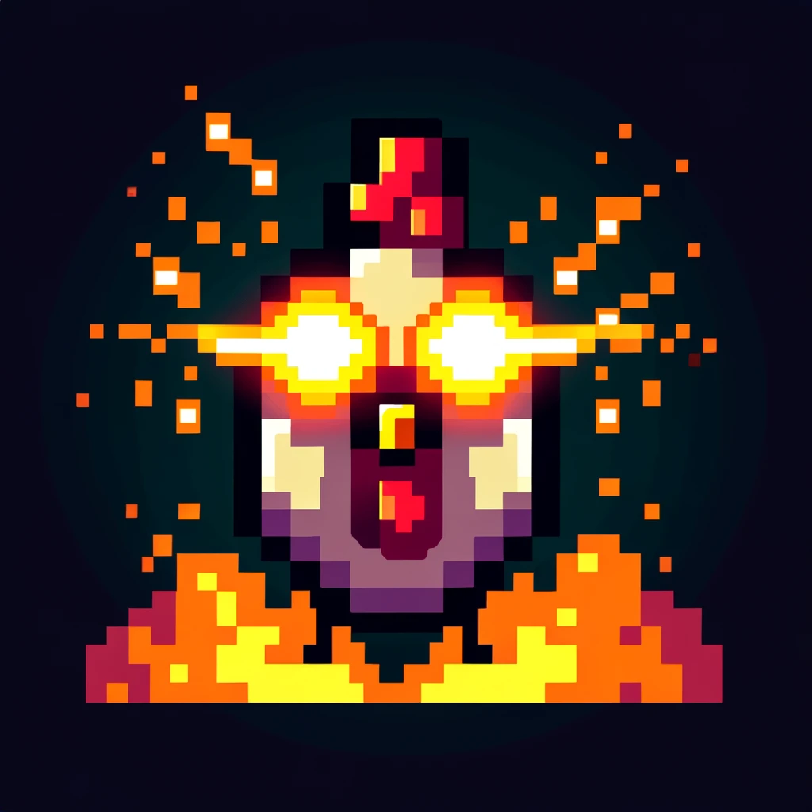

# EKKI

## Development TODO list
- [ ] **entity actions**
    - [x] 8 direction walking
    - [x] 4 direction walking animations
    - [ ] attack
        - [ ] ranged
        - [ ] melee
    - [ ] item pickup
    - [ ] roll
    - [ ] jump

- [ ] **game design**
    - [x] map editor
        - [x] draw terrain
        - [x] delete terrain
        - [x] map saving
        - [x] map loading
    - [ ] camera
        - [ ] follow player
        - [ ] zoom
        - [ ] shake when hit

    - [ ] sounds
        - [ ] general sound effects
        - [ ] normal music
        - [ ] boss music

- [ ] **ui**
    - [ ] health, stamina etc..
    - [ ] inventory
    - [ ] map
    - [ ] dialogue ??
    - [ ] damage indicators

- [ ] **so much more shit to implement**

## Screenshots

